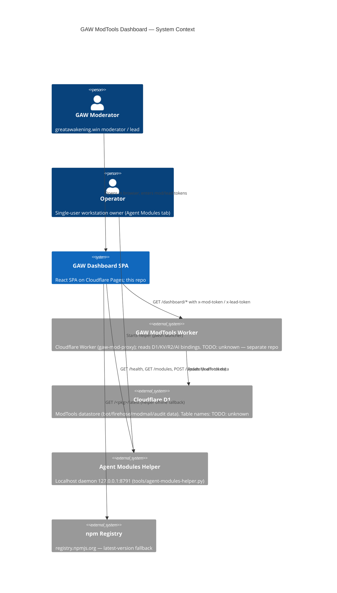
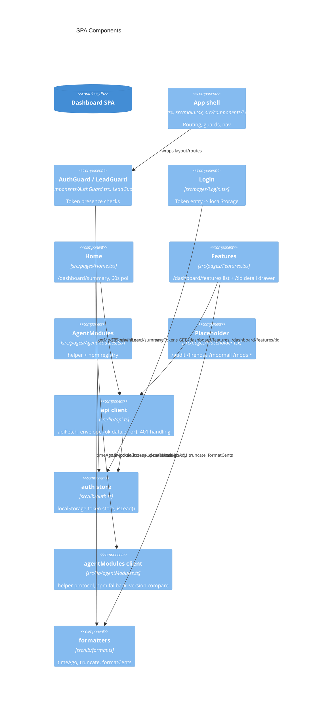
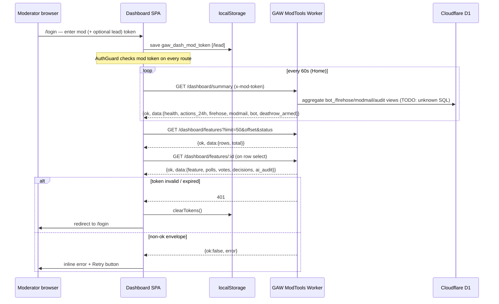
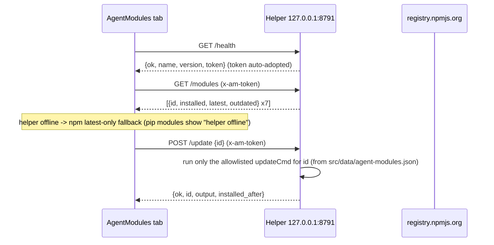
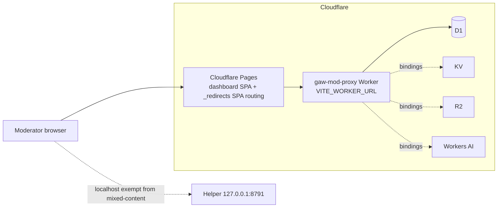

# GAW ModTools Dashboard — Architecture (C4-lite)

Scope: the `gaw-dashboard` SPA (this repo). The GAW ModTools Cloudflare Worker and its D1 database are external systems seen only through their HTTP contract (`/dashboard/*` endpoints). Everything not observable from this repo is marked **TODO: unknown**.

## Level 1 — System context



Context facts (from this repo):

- The SPA is deployed to Cloudflare Pages (`public/_redirects` for SPA routing). Deployed URL/project name: **TODO: unknown**.
- Worker base URL comes from `VITE_WORKER_URL` (`.env.example` points at `https://gaw-mod-proxy.gaw-mods-a2f2d0e4.workers.dev`).
- The helper binds 127.0.0.1 only; CORS allows localhost dev origins and `*.pages.dev`; writes are gated by a per-run token echoed via `/health`.

## Level 2 — Containers (runtime pieces of this repo)

```mermaid
C4Container
title Containers in the browser and beside it

Container_Boundary(browser, "Browser") {
  Container(spa, "Dashboard SPA", "Vite + React 18 + TS + Tailwind + TanStack Query", "Routes: /login, /, /features, /modules + placeholders")
  ContainerStorage(ls, "localStorage", "gaw_dash_mod_token, gaw_dash_lead_token")
}

Container_Boundary(workstation, "Operator workstation") {
  Container(helperd, "Agent Modules Helper", "Python stdlib HTTP daemon", "127.0.0.1:8791; /health /modules /update")
  Container(manifest, "agent-modules.json", "src/data/agent-modules.json", "7-module registry + updateCmd allowlist; shared truth for tab and helper")
}

Rel(spa, ls, "read/write tokens")
Rel(spa, helperd, "version state + allowlisted updates")
Rel(helperd, manifest, "reads allowlisted updateCmd per id")
```

## Level 3 — Components (SPA internals, real paths)



## Data flow — request lifecycle



## Agent Modules side channel



## Deployment shape



Notes and unknowns:

- Build output `dist/` is produced by `npm run build` (`tsc -b && vite build`); Pages project name and deployment pipeline: **TODO: unknown**.
- Worker-side CORS configuration for `/dashboard/*`: **TODO: unknown** (the SPA calls the workers.dev origin directly, cross-origin, with `content-type: application/json` + token headers).
- Where the D1 data originates (Discord bot ingestion, site crawler, modmail sync): **TODO: unknown** — owned by the ModTools Worker repo (location: **TODO: unknown**).
- `health.bindings{D1,KV,R2,AI}` is surfaced by `/dashboard/summary`; what each binding is used for server-side is **TODO: unknown**.
